# VectorVault

> **Air-gapped enterprise RAG workstation — local inference, zero cloud egress.**  
> Built with Microsoft Foundry Local for institutions where data never leaves the perimeter.

[](#)
[](#)
[](#)
[](backend/requirements.txt)
[](frontend/package.json)
[](#)
[](#)

---

## What is VectorVault?

**VectorVault** is a production-grade, fully offline Retrieval-Augmented Generation (RAG) platform. It lets enterprise operators upload compliance documents, financial policies, and internal knowledge bases — then query them in plain English using small language models running entirely on-device.

**No cloud. No API keys. No data egress. Ever.**

Every step — from embedding generation to LLM inference — runs locally through **Microsoft Foundry Local**. This makes VectorVault suitable for financial services, legal, insurance, and other regulated industries worldwide — where sensitive documents cannot leave the internal network.

> Developed as part of the **Microsoft AI Innovators Summer Internship** — demonstrating an end-to-end offline RAG stack at enterprise scale.

---

## Screenshots

### Login Page

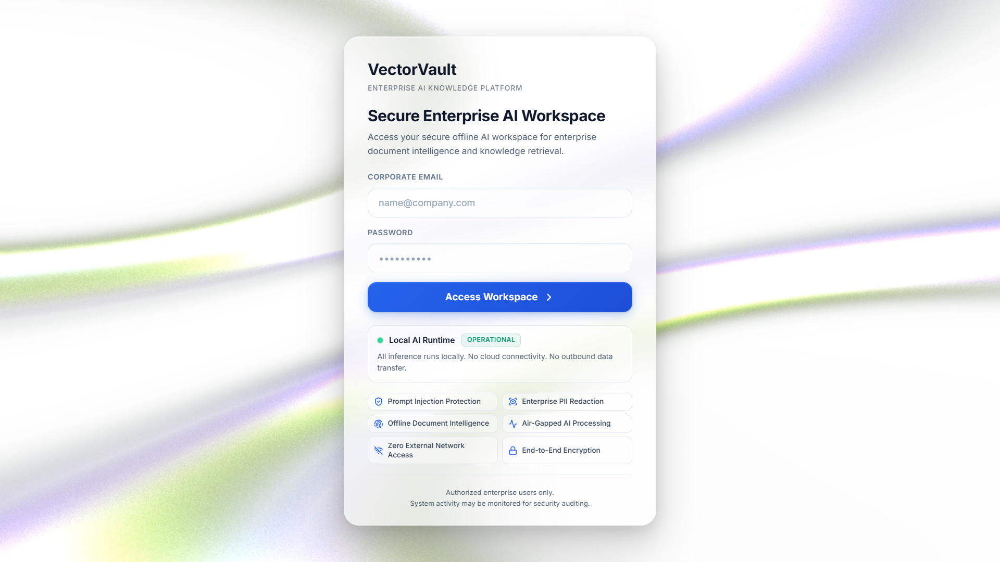

*Glass-morphism card over an animated WebM background — JWT-gated corporate workspace entry.*

### Dashboard

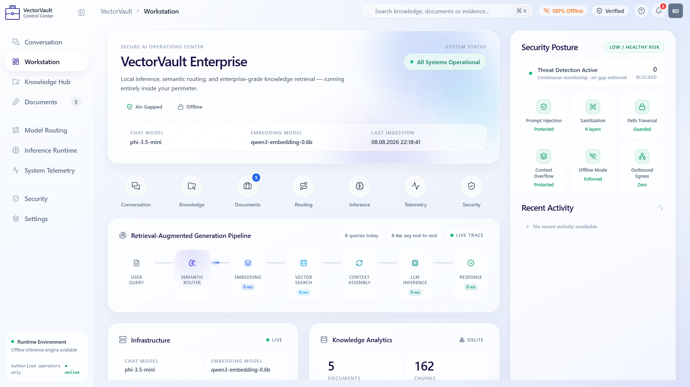

*VectorVault Workstation — live RAG pipeline trace, security posture rail, and KPI strip.*

### Conversation

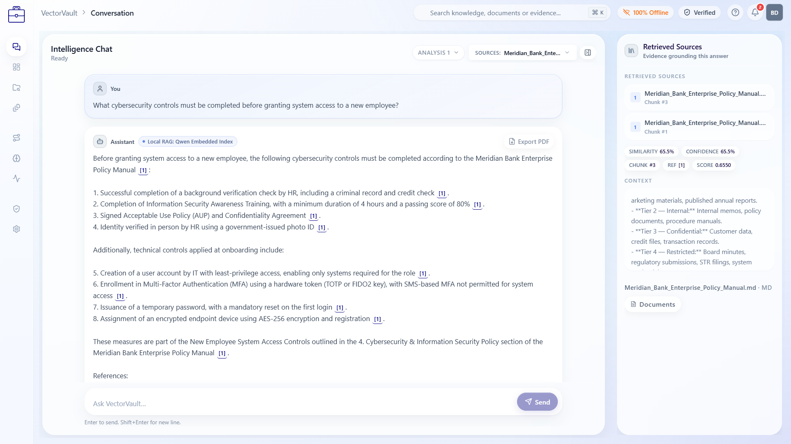

*SSE-streamed chat with inline `[n]` citations, Evidence panel, and animated AI orb.*

### System Telemetry

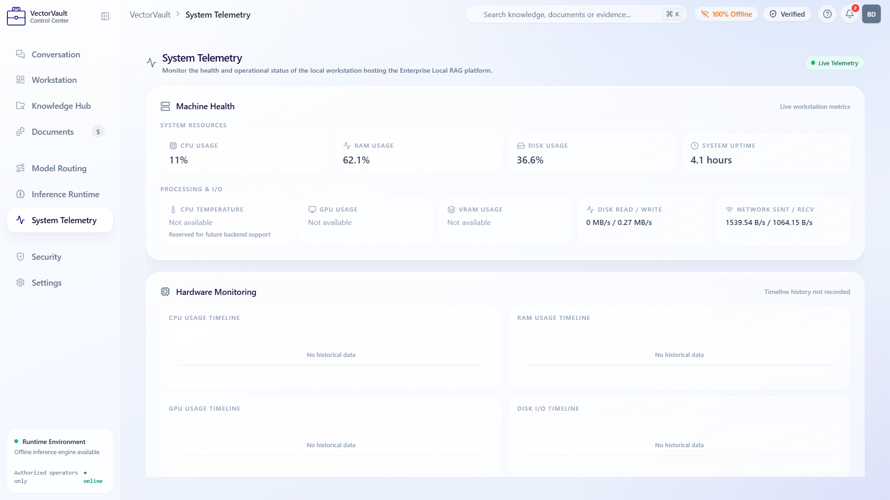

*Real-time machine health: CPU, RAM, disk, network, and SQLite vector index stats.*

### Security Center

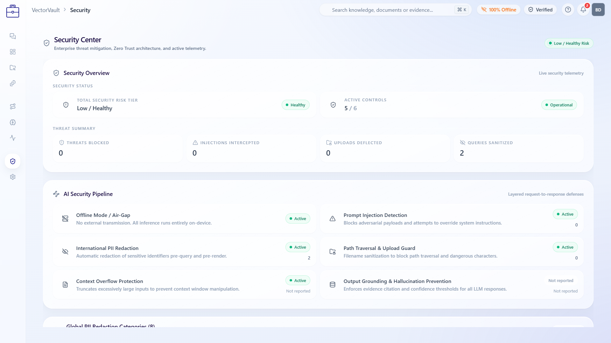

*AI security pipeline — threat counters, PII redaction layers, and Zero Trust controls.*

### Knowledge Hub

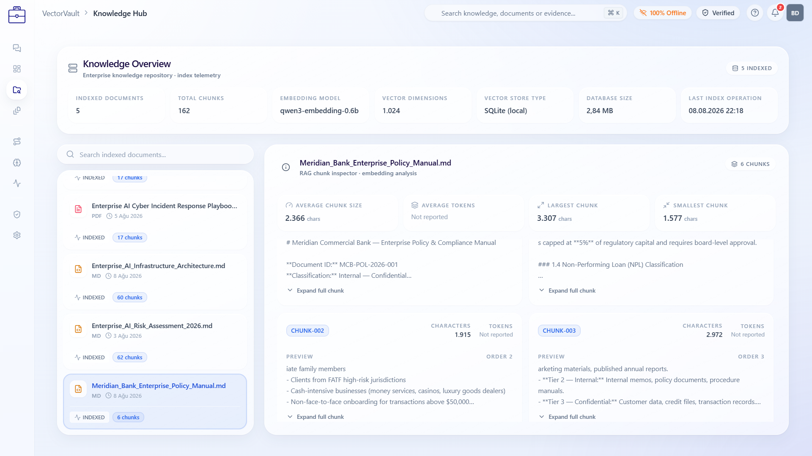

*Indexed vault inventory with chunk explorer and vector-store embedding telemetry.*

### Inference Runtime

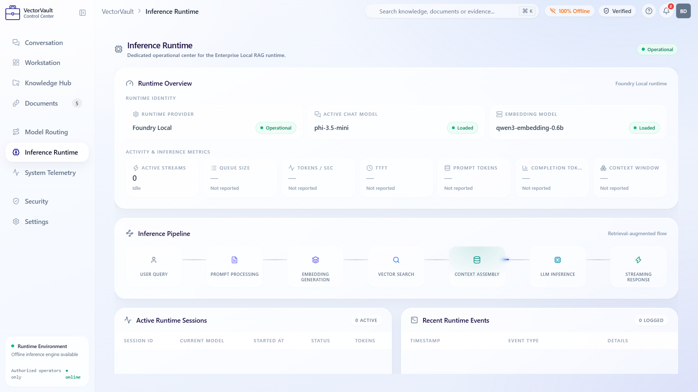

*Foundry Local runtime status, inference pipeline stages, and active session log.*

### Model Routing

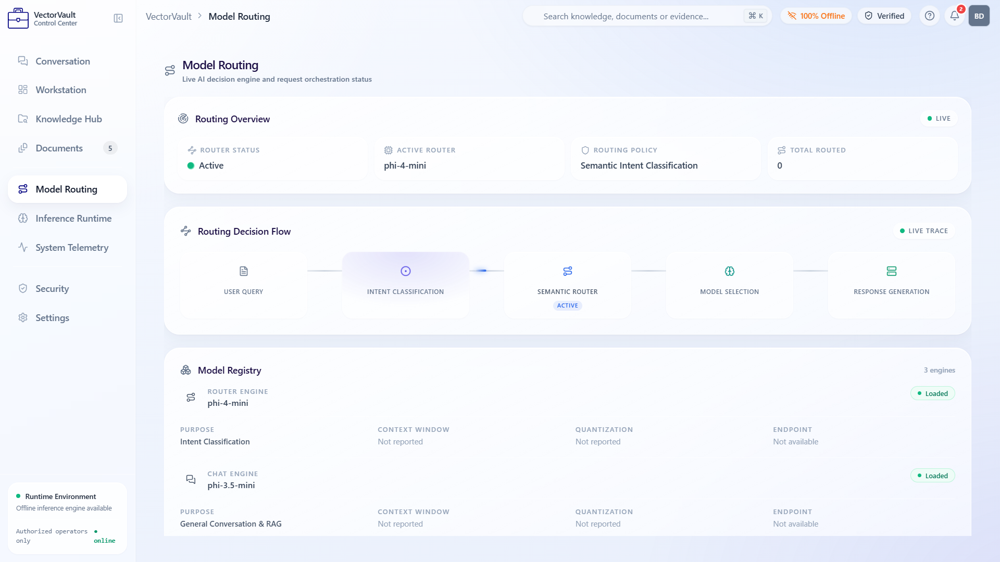

*Live semantic intent classification and routing decision flow across three model tracks.*

### Documents

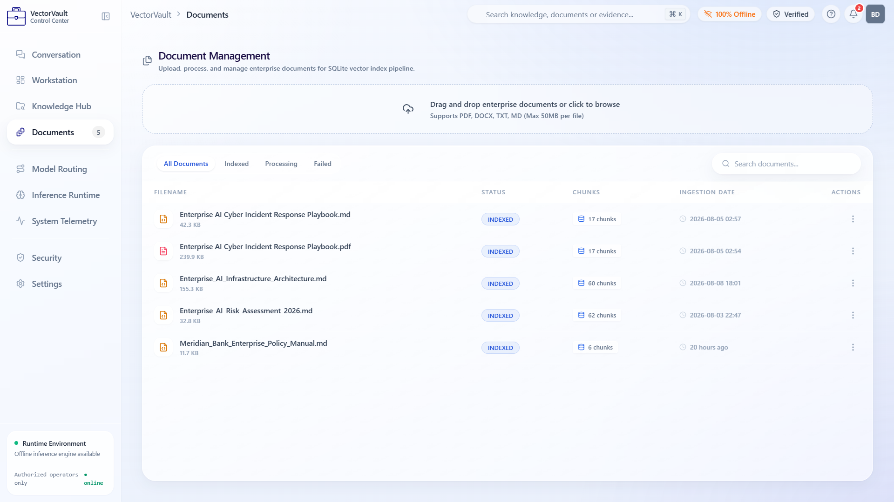

*Enterprise document management — drag-and-drop upload, index pipeline, chunk tracking.*

### Settings

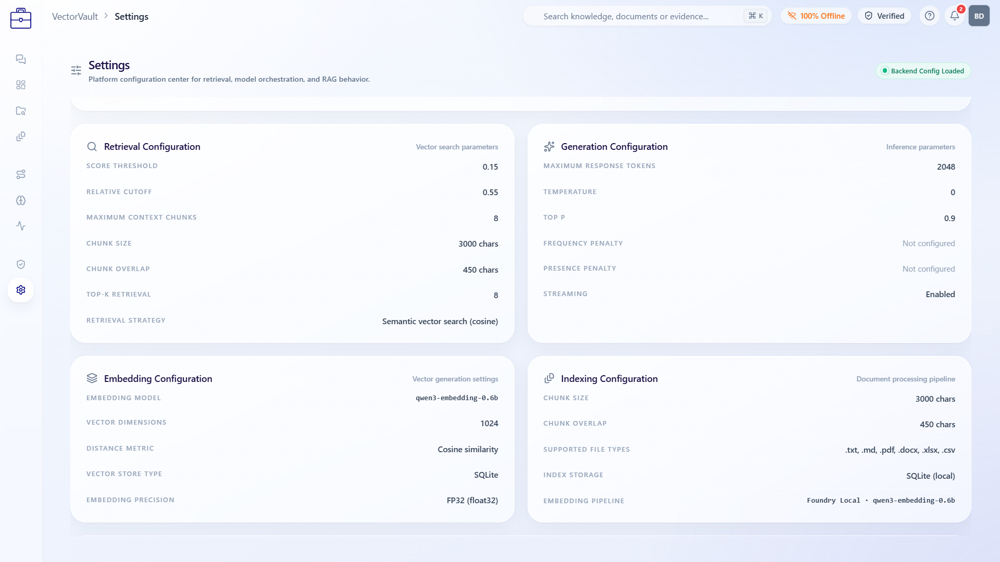

*Retrieval thresholds, generation parameters, embedding config, and indexing pipeline.*

---

## Architecture

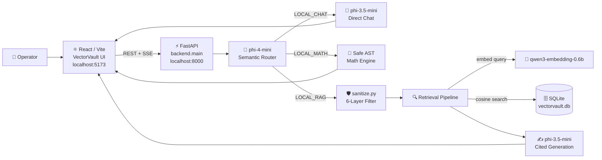

**Full request flow (RAG track):**

1. User query enters FastAPI (CORS-scoped, localhost only)
2. `phi-4-mini` semantic router selects `LOCAL_RAG` / `LOCAL_MATH` / `LOCAL_CHAT`
3. 6-layer query sanitization (Unicode NFC → control strip → HTML strip → injection redact → collapse → 2000-char cap)
4. `qwen3-embedding-0.6b` embeds the query on-device via Foundry Local
5. NumPy cosine search over SQLite FP32 BLOB embeddings
6. 4-stage filter (absolute threshold 0.15 → relative cutoff 0.55 → fingerprint dedupe → hard cap 8 chunks)
7. Context assembly with `SOURCE BEGIN/END` fences
8. `phi-3.5-mini` generation (temperature 0.0, evidence-only prompt)
9. SSE stream with inline `[n]` citations and a deterministic References block
10. Optional numeric audit (financial figure cross-check)

---

## Features

### Core Intelligence

**Semantic Routing** — `phi-4-mini` classifies every query into one of three execution tracks with deterministic fallback. RAG queries hit the retrieval pipeline. Math queries go to a safe AST evaluator with no LLM involvement. General queries go directly to the chat model.

**Precision Retrieval** — Cosine similarity search over FP32 BLOB embeddings stored in SQLite. Entity and header keyword boosts improve recall on structured documents. A four-stage filter (absolute score threshold, relative cutoff, fingerprint deduplication, hard context cap) ensures the model only sees high-quality evidence.

**Grounded Generation** — The LLM is constrained to answer only from retrieved context. Responses include inline `[n]` citations mapped to source chunks. When evidence is insufficient, a canonical refusal sentence is returned — the model never fabricates.

**Numeric Audit** — A post-generation pass cross-checks significant financial figures in the answer against retrieved evidence, flagging mismatches before the response reaches the user.

### System Prompt Design

RAG generation uses a lean system prompt plus a per-request user contract assembled in `generation.py`:

- **Evidence-only** — The system prompt (`SYSTEM_PROMPT` in `config.py`) requires answers from retrieved context chunks only; the user message marks numbered `SOURCE BEGIN/END` fences as the sole source of truth and forbids blending facts across fences unless the excerpts themselves correlate them.
- **Citation enforcement** — Facts must be cited inline as `[1]`, `[2]`, …; the server builds a filename→number map, strips any model-written References/Sources section, and appends a deterministic References block for cited (or all) sources.
- **Refusal contract** — If the sources do not explicitly contain the answer, the model must reply with exactly `NO_CONTEXT_ANSWER` (`"This information is not available in the uploaded documents."`) and nothing else; refusal leaks and `(Note: …)` meta-commentary are scrubbed from substantive answers.

### Document Processing

**Multi-Format Ingestion** — `.txt`, `.md`, `.pdf`, `.docx`, `.xlsx`, `.csv`. Tabular rows from spreadsheets become individually queryable text strings.

**Structure-Aware Chunking** — Recursive splitter with 3000-character chunks and 450-character overlap. Markdown-aware separators preserve heading hierarchy. Mid-sentence and section-header boundary chunks are merged with adjacent chunks to prevent context fragmentation.

### Security & Compliance

**Air-Gap Enforcement** — Zero outbound network requests. Foundry Local runs entirely on-device. The Security Center UI actively monitors and reports `zero_outbound` status.

**6-Layer Query Sanitization** — Unicode normalization → C0/C1 control strip → HTML tag removal → prompt injection redaction → whitespace collapse → 2000-character hard cap.

**Prompt Injection Detection** — Regex neutralization of adversarial override phrases. All detections are counted and surfaced in the Security Center.

**International PII Redaction** — Automatic redaction of sensitive identifiers before query processing and before render.

**JWT Operator Auth** — SHA-256 password verification, HS256 JWT (12-hour expiry), full `audit_logs` trail for every AUTH event.

### Developer Experience

**SSE Streaming** — `/query/stream` emits structured status events, agent track badges, token fragments, and `[SOURCES]` payloads consumed by the Evidence panel in real time.

**Executive PDF Export** — One-click export of any conversation to a formatted PDF report with source citations, author metadata, and a system ID. Unicode/Turkish character support via embedded DejaVu Sans font.

**Live Telemetry** — CPU, RAM, disk, network, and SQLite vector index stats served by `psutil` and surfaced in the System Telemetry module.

**OpenAPI Docs** — Full interactive API documentation at `http://127.0.0.1:8000/docs`.

---

## Tech Stack

### Frontend

| Technology | Version | Purpose |
|---|---|---|
| React + React DOM | `^19.2.6` | UI framework |
| React Router | `^7.18.2` | Client-side routing |
| Vite | `^8.0.12` | Build tool & dev server |
| TypeScript | `^5.7.3` | Type safety |
| Tailwind CSS | `^3.4.19` | Utility-first styling |
| Lucide React | `^0.383.0` | Icon system |
| Framer Motion | `^12.42.2` | Animations |
| Recharts | `^2.x` | Telemetry charts |
| Axios | `^1.18.0` | HTTP client |

### Backend

| Technology | Version | Purpose |
|---|---|---|
| FastAPI | `>=0.111.0` | API framework |
| Uvicorn | `>=0.29.0` | ASGI server |
| Pydantic | `>=2.7.0` | Data validation |
| NumPy | `>=1.26.0` | Vector math (cosine similarity) |
| psutil | `>=5.9.0` | System telemetry |
| PyJWT | `>=2.8.0` | JWT auth |
| pypdf / pymupdf | latest | PDF parsing |
| python-docx | latest | DOCX parsing |
| pandas + openpyxl | latest | XLSX/CSV parsing |

### Inference & Storage

| Component | Technology |
|---|---|
| Inference runtime | Microsoft Foundry Local SDK |
| Chat model | `phi-3.5-mini` |
| Router model | `phi-4-mini` |
| Embedding model | `qwen3-embedding-0.6b` (1024-dim, FP32) |
| Vector store | SQLite — BLOB columns for embeddings |
| Database | `data/vectorvault.db` (local file, gitignored) |

---

## Directory Structure

```
vectorvault-enterprise/
│
├── README.md
├── .gitignore
├── package.json
│
├── backend/                          # FastAPI application
│   ├── main.py                       # App entry point, health & telemetry routes
│   ├── config.py                     # Model aliases, chunking & retrieval thresholds
│   ├── sanitize.py                   # 6-layer query & filename sanitization
│   ├── requirements.txt
│   ├── logging_config.py
│   ├── startup_check.py              # Foundry Local preflight
│   ├── runtime_diagnostics.py
│   │
│   ├── db/
│   │   ├── database.py               # SQLite connection management
│   │   ├── schema.py                 # users, audit_logs, documents, vector_chunks
│   │   └── vector_store.py           # Embedding insert / cosine search / inventory
│   │
│   ├── routers/
│   │   ├── query.py                  # POST /query  ·  GET /query/stream (SSE)
│   │   ├── documents.py              # /api/v1/documents CRUD + PDF export
│   │   └── api_v1.py                 # Auth, telemetry, config, security logs
│   │
│   └── services/
│       ├── foundry_client.py         # Foundry Local SDK — embed / chat / router
│       ├── ingestion.py              # Multi-format parser + recursive chunker
│       ├── retrieval.py              # 4-stage filtered cosine retrieval
│       ├── generation.py             # Grounded generation + citation mapping
│       ├── chat_handler.py           # Direct chat track handler
│       ├── semantic_router.py        # phi-4-mini routing logic
│       ├── intent.py                 # Fallback intent classification
│       ├── math_handler.py           # Safe AST math evaluator
│       ├── numeric_audit.py          # Post-generation financial figure check
│       ├── document_metadata.py
│       ├── pdf_export.py             # Executive PDF with DejaVu Sans Unicode font
│       └── metrics.py                # Security counters & analytics
│
├── data/
│   ├── vault/                        # Source documents for ingestion (gitignored)
│   └── vectorvault.db                # Live SQLite vector index (gitignored)
│
├── docs/
│   └── screenshots/                  # UI captures for README
│
├── frontend/                         # React / Vite SPA
│   ├── index.html
│   ├── package.json
│   ├── vite.config.js                # Dev server port 5173, proxy → :8000
│   ├── tailwind.config.js
│   │
│   ├── public/
│   │   ├── color-bends-*.webm        # Login page background video
│   │   └── favicon.svg
│   │
│   └── src/
│       ├── App.tsx                   # Routes: / (login) → /workstation
│       ├── main.tsx
│       ├── index.css                 # Glass + orb design system tokens
│       ├── api/client.ts             # Axios client + SSE stream handler
│       ├── pages/LoginPage.tsx       # Glass login with JWT session
│       ├── context/WorkstationContext.tsx
│       ├── modules/                  # Feature modules (Chat, Docs, Hub, …)
│       ├── components/
│       │   ├── chat/                 # ConversationCanvas, citations, filters
│       │   ├── evidence/             # Retrieved Sources panel
│       │   └── workstation/          # Shell, sidebar, overview, telemetry
│       ├── lib/answerScrub.ts
│       └── types/workstation.ts
│
└── scripts/
    └── check-runtime.ps1             # Windows: offline diagnostics + HTTP probes
```

---

## Setup & Usage

### Prerequisites

- **Python 3.10+**
- **Node.js 18+**
- **Microsoft Foundry Local** — install and start the service:

```powershell
winget install Microsoft.FoundryLocal
foundry service start
```

- Models pulled automatically by Foundry Local on first run: `phi-3.5-mini`, `phi-4-mini`, `qwen3-embedding-0.6b`

---

### 1 — Backend

Run all commands from the **repository root** (the `backend.*` package imports require it):

```bash
# Create virtual environment
python -m venv .venv

# Activate (Windows)
.venv\Scripts\activate

# Activate (macOS / Linux)
# source .venv/bin/activate

# Install dependencies
pip install -r backend/requirements.txt

# Optional: verify Foundry Local is ready
python -m backend.startup_check

# Start the API server
python -m uvicorn backend.main:app --reload --port 8000
```

API available at **http://127.0.0.1:8000** · Docs at **http://127.0.0.1:8000/docs**

---

### 2 — Frontend

```bash
cd frontend
npm install
npm run dev
```

Workstation UI at **http://localhost:5173**

In development, `/api`, `/documents`, and `/query` requests proxy automatically to `http://127.0.0.1:8000`.

---

### 3 — Load Documents

Place `.pdf`, `.docx`, `.md`, `.txt`, `.xlsx`, or `.csv` files in `data/vault/`, then upload and index them through the **Documents** or **Knowledge Hub** modules in the UI.

Vault contents are gitignored — your documents stay local.

---

### 4 — Sign In

Sign in with an authorized operator account for your local deployment.

Accepted email domains for local evaluation: `@vectorvault.local`, `@bank.com`, `@organization.com`, `@enterprise.com`

After a successful login, a JWT is stored in `localStorage` and the session navigates to `/workstation`.

> Rotate default auth secrets and operator accounts before any shared or production deployment.

---

### 5 — Runtime Check (Windows)

```powershell
.\scripts\check-runtime.ps1
```

Runs `backend.runtime_diagnostics`, then probes ports `:8000` and `:5173`.

---

## Security & Compliance

| Control | Implementation |
|---|---|
| **Air-gap / Zero Egress** | Foundry Local Core only. `/api/security` reports `offline_mode: true` and `zero_outbound: verified`. Outbound Egress counter is always 0. |
| **Prompt Injection Detection** | Adversarial override phrases neutralized to `[REDACTED]` via regex in `sanitize.py`. Counter surfaced in Security Center. |
| **6-Layer Query Sanitization** | Unicode NFC → C0/C1 control strip → HTML tag removal → injection redaction → whitespace collapse → 2000-char hard cap. |
| **Path Traversal Guard** | `sanitize_filename()` strips to basename only; removes all Windows/POSIX-unsafe characters. |
| **Upload Allowlist** | Extension + MIME-type allowlist for `.txt .md .pdf .docx .xlsx .csv`. Rejected uploads are logged and counted. |
| **Context Overflow Protection** | Query length cap, `MAX_CONTEXT_CHUNKS = 8`, `MAX_TOTAL_PROMPT_CHARS` budget enforced before LLM call. |
| **Output Grounding** | Evidence-only system prompt, citation map enforced, canonical refusal on missing evidence, numeric audit post-pass. |
| **Operator Auth & Audit** | SHA-256 password check · HS256 JWT (12 h expiry) · `audit_logs` table records every AUTH success and denial. |
| **CORS Policy** | Restricted to `localhost` Vite origins on ports `517x` only. |
| **International PII Redaction** | 8-category PII redaction applied uniformly across all documents and queries pre-render. |

> Local evaluation auth is for development only. Rotate operator accounts and signing secrets before any shared deployment.

---

## API Reference

| Method | Endpoint | Description |
|---|---|---|
| `GET` | `/` | Liveness check |
| `GET` | `/api/status` | Model status, uptime, document inventory |
| `GET` | `/api/telemetry` | CPU / RAM / disk / vector index metrics |
| `GET` | `/api/security` | Threat counters + Zero Trust capability flags |
| `GET` | `/api/analytics` | Pipeline latency and routing snapshot |
| `POST` | `/api/v1/auth/login` | Operator JWT authentication |
| `GET` | `/api/v1/documents` | List indexed documents |
| `POST` | `/api/v1/documents/upload` | Upload and index a document |
| `DELETE` | `/api/v1/documents/{id}` | Remove a document and its chunks |
| `GET` | `/api/v1/documents/{id}/export-pdf` | Export executive PDF report |
| `POST` | `/query` | Blocking RAG query |
| `GET` | `/query/stream` | SSE streaming RAG query |
| `GET` | `/api/v1/config` | Live retrieval & generation settings |
| `GET` | `/api/v1/telemetry/system` | Extended host telemetry |

Full interactive docs: **http://127.0.0.1:8000/docs**

---

## License & Attribution

**VectorVault** *(originally FinansAsistan)* was developed as part of the **Microsoft AI Innovators Summer Internship** evaluation track.

Inference powered by **[Microsoft Foundry Local](https://github.com/microsoft/foundry-local)**.  
UI product branding: **VectorVault**.
