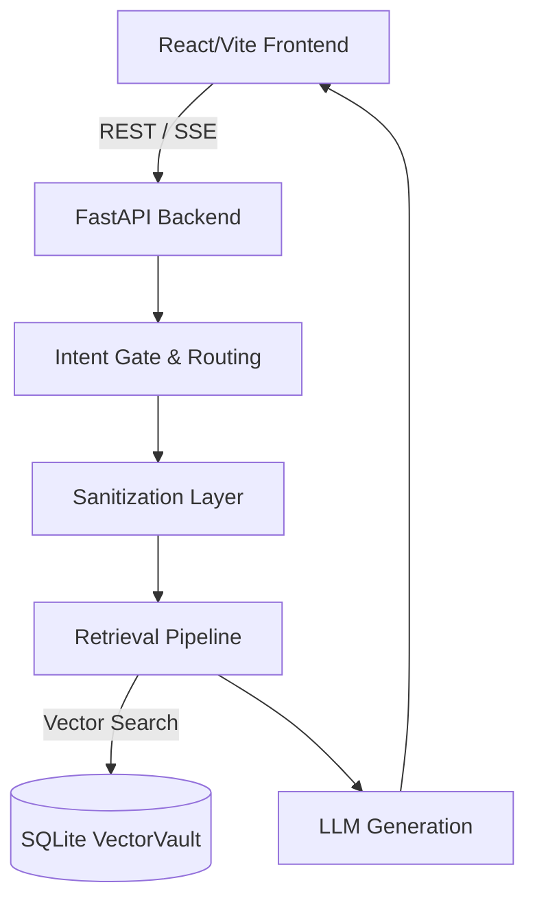

# FinansAsistan — Enterprise Local RAG Workstation

> An air-gapped, compliance-ready Retrieval-Augmented Generation (RAG) pipeline built for financial and regulatory compliance analysis. 
> 
> No cloud APIs. No data egress. Every inference, embedding, and vector search runs locally on-device.

---

## 1. Project Overview

**FinansAsistan** is an enterprise-grade document intelligence system designed for institutions operating under strict data-privacy constraints (e.g., BDDK, GDPR). 

It ingests financial circulars, internal procedures, and regulatory policy documents, storing them in a semantic vector database. Users can then query these documents in natural language, relying on a fully local small language model to deliver highly accurate, context-bound responses without ever sending sensitive data over the public internet.

---

## 2. Core Architecture

The architecture enforces strict data locality across a modular stack:

- **Frontend:** React + Vite workstation providing a responsive, professional chat and dashboard interface.
- **Backend:** High-performance FastAPI application handling intent routing, query processing, and document parsing.
- **Storage:** SQLite VectorVault (`vectorvault.db`) embedded vector database for fast similarity search.
- **Inference Engine:** Integration with local LLM & embedding providers (e.g., Microsoft Foundry Local SDK) for offline generation.



---

## 3. Key Features

- **Robust Sanitization:** Math LaTeX and input sanitization (`sanitize.py`) prevents prompt injection, UI rendering bugs, and context window overflows.
- **Precision Retrieval:** Advanced chunking strategy (e.g., 250-character overlap) paired with header-boosted semantic retrieval for hyper-accurate document recall.
- **Multi-Format Support:** Seamlessly ingests and processes various file types including `.md`, `.pdf`, and `.docx`.
- **4-Stage Filtering Pipeline:** Absolute thresholding, relative cutoff scoring, deduplication, and hard capping to ensure maximum contextual density and minimum token waste.
- **Air-Gapped & Secure:** Absolutely no external data transmission. Perfect for sensitive compliance documents.

---

## 4. Directory Tree

```
finansasistan-local-rag/
├── .gitignore               # Strict exclusion of sensitive/generated files
├── README.md                # This file
├── backend/                 # FastAPI Application
│   ├── config.py            # Unified configuration (DB paths, constants)
│   ├── main.py              # Application entry point
│   ├── sanitize.py          # Input sanitization and formatting
│   ├── requirements.txt     # Pinned Python dependencies
│   ├── db/                  # Database management (schema & vector store)
│   ├── routers/             # API endpoints (query, documents)
│   └── services/            # Core logic (retrieval, ingestion, inference)
├── data/                    # Storage directory
│   ├── vault/               # Raw input documents (.pdf, .md, .docx)
│   ├── docs/                # Generated or processed documents
│   └── vectorvault.db       # Active SQLite Vector database
├── frontend/                # React / Vite SPA
│   ├── package.json
│   ├── src/                 # UI components and API clients
│   └── ...
└── scripts/                 # Utility scripts (e.g., runtime checks)
```

---

## 5. Setup & Usage Guide

### Prerequisites
- Python 3.10+
- Node.js 18+
- An appropriate local inference provider configured (e.g., Foundry Local CLI).

### Step 1: Python Environment Setup

Create a virtual environment and install the backend dependencies.

```bash
cd backend
python -m venv .venv

# On Windows:
.venv\Scripts\activate
# On Unix/macOS:
# source .venv/bin/activate

pip install -r requirements.txt
```

### Step 2: Frontend Setup

Install the Node dependencies for the React app.

```bash
cd frontend
npm install
```

### Step 3: Document Placement

Place your compliance, regulatory, or policy documents (`.pdf`, `.docx`, `.md`) into the designated vault directory:

```
data/vault/
```

*(Note: The system strictly ignores `data/vault/*` in version control, keeping your raw files safe from accidental commits).*

### Step 4: Running the Application

**Start the Backend Server:**

Open a terminal, activate your virtual environment, and start the FastAPI server:

```bash
cd backend
# Starts the server on http://localhost:8000
uvicorn main:app --host 0.0.0.0 --port 8000 --reload
```

**Start the Frontend Development Server:**

In a separate terminal, start the Vite development server:

```bash
cd frontend
# Starts the frontend on http://localhost:5173
npm run dev
```

### Step 5: Ingestion and Querying

1. Navigate to the frontend (e.g., `http://localhost:5173`).
2. Trigger the ingestion process via the dashboard to parse the documents in `data/vault/` and populate `vectorvault.db`.
3. Use the chat interface to query your financial and regulatory documents securely.
