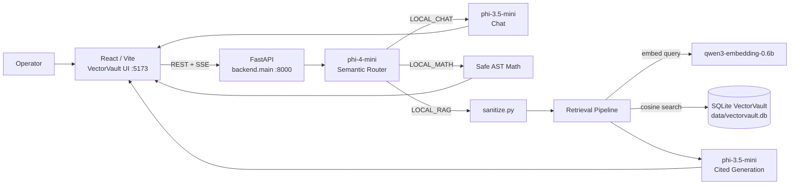

# FinansAsistan

**Air-gapped enterprise RAG workstation — local inference, zero cloud egress.**

[](#)
[](#)
[](#)
[](backend/requirements.txt)
[](frontend/package.json)
[](frontend/package.json)
[](frontend/package.json)
[](#)

---

## Overview

**FinansAsistan** (product UI: **VectorVault**) is a fully local Retrieval-Augmented Generation platform for secure document intelligence. Operators ingest policy, risk, and operational documents into an on-device SQLite vector store, then query them in natural language. Every embedding, retrieval step, and LLM completion runs through **Microsoft Foundry Local** — no public cloud APIs, no outbound model traffic.

The system is built for institutions that cannot send regulated content off-premises: commercial credit, cyber incident playbooks, infrastructure architecture notes, and similar internal corpora. It was developed in the context of the **Microsoft AI Innovators Summer Internship**, demonstrating an end-to-end offline RAG stack suitable for academic and engineering evaluation.

---

## Architecture



**Request flow (LOCAL_RAG):** User question → CORS-scoped FastAPI → intent / track classification → multi-layer query sanitization → Foundry embedding → NumPy cosine search over `vector_chunks` → absolute + relative score filters, dedupe, context cap → prompt assembly with source fences → streamed SSE tokens → deterministic References block + optional numeric audit notes.

---

## Features

Derived from the implemented codebase (not aspirational):

| Area | What the code does |
|------|--------------------|
| **Semantic routing** | `phi-4-mini` classifies each query into `LOCAL_RAG`, `LOCAL_MATH`, or `LOCAL_CHAT`, with deterministic fallback (`semantic_router.py`, `intent.py`). |
| **Local math track** | Safe AST evaluation for arithmetic, percentages, and aggregates — no LLM, no network (`math_handler.py`). |
| **Document ingestion** | Extractors for `.txt`, `.md`, `.pdf`, `.docx`, `.xlsx`, `.csv`; tabular rows become queryable strings (`ingestion.py`). |
| **Recursive chunking** | Structure-aware splitter: 3000-char chunks, 450-char overlap, markdown-aware separators (`config.py`, `ingestion.py`). |
| **Vector retrieval** | Cosine similarity over FP32 blobs in SQLite; entity/header keyword boosts; 4-stage filter: absolute threshold (`0.15`), relative cutoff (`0.55`), fingerprint dedupe, hard cap (`MAX_CONTEXT_CHUNKS = 8`). |
| **Chunk continuity** | Mid-sentence / section-header chunks merge with the next index when needed (`retrieval.py`). |
| **Grounded generation** | Context-only answers, inline `[n]` citations, canonical refusal sentence when evidence is missing; temperature `0.0` (`generation.py`). |
| **Numeric audit** | Post-generation check that significant financial figures in the answer align with retrieved evidence (`numeric_audit.py`). |
| **SSE streaming** | `/query/stream` emits status steps, agent badges, tokens, and `[SOURCES]` payloads for the Evidence panel. |
| **Executive PDF** | Export credit-analysis reports via WeasyPrint / xhtml2pdf (`pdf_export.py`). |
| **Operator auth** | JWT login against SQLite `users` + `audit_logs` (`/api/v1/auth/login`). |
| **Workstation modules** | Conversation, Workstation dashboard, Knowledge Hub, Documents, Model Routing, Inference Runtime, System Telemetry, Security, Settings. |
| **Live telemetry** | CPU / RAM / disk / network / vector-index metrics via `psutil` and SQLite (`/api/telemetry`, `/api/v1/telemetry/system`). |

---

## Tech Stack

| Layer | Technology | Version / alias (from config) |
|-------|------------|-------------------------------|
| **Frontend** | React, React DOM, React Router | `^19.2.6`, `^7.18.2` |
| | Vite, TypeScript, Tailwind CSS | `^8.0.12`, `^5.7.3`, `^3.4.19` |
| | axios, framer-motion, lucide-react, recharts | `^1.18.0`, `^12.42.2`, `^1.27.0`, `^3.9.2` |
| **Backend** | FastAPI, Uvicorn, Pydantic | `>=0.111.0`, `>=0.29.0`, `>=2.7.0` |
| | NumPy, psutil, PyJWT | `>=1.26.0`, `>=5.9.0`, `>=2.8.0` |
| | PyPDF2 / pypdf / pymupdf, python-docx, pandas, openpyxl | see `backend/requirements.txt` |
| **Vector store** | SQLite (`data/vectorvault.db`) — documents + BLOB embeddings | local file |
| **Inference** | Microsoft Foundry Local SDK | `foundry-local-sdk>=0.1.0` |
| | Chat | `phi-3.5-mini` |
| | Router | `phi-4-mini` |
| | Embeddings | `qwen3-embedding-0.6b` |
| **Security** | `sanitize.py`, upload allowlists, JWT + audit log, offline Foundry runtime | in-process |

---

## UI Highlights

- **Conversation orb** — Ambient CSS intelligence orb (`.vv-ai-orb`) with breathe / aurora spin animations on the Conversation canvas empty and streaming states.
- **Glass-morphism login** — Full-bleed looping WebM background (`color-bends-*.webm`) behind a frosted VectorVault glass card; corporate-domain gate + JWT session.
- **Lucide icon system** — Consistent stroke icons across sidebar navigation, modules, Evidence, and Security Center.
- **VectorVault dashboard** — Workstation overview with RAG pipeline visualization, security rail, KPI strip, and live telemetry panels (Fluent-inspired glass surfaces in `index.css` / Tailwind tokens).

---

## Directory Tree

```
finansasistan-local-rag/
├── README.md
├── package.json                 # root helper deps
├── .gitignore
├── backend/
│   ├── main.py                  # FastAPI app, health/telemetry/security routes
│   ├── config.py                # models, chunking, retrieval thresholds
│   ├── sanitize.py              # query / filename / LaTeX sanitization
│   ├── requirements.txt
│   ├── logging_config.py
│   ├── startup_check.py         # Foundry Local preflight
│   ├── runtime_diagnostics.py
│   ├── db/
│   │   ├── database.py
│   │   ├── schema.py            # users, audit_logs, documents, vector_chunks
│   │   └── vector_store.py      # insert / search / inventory
│   ├── routers/
│   │   ├── query.py             # POST /query, GET /query/stream
│   │   ├── documents.py         # /api/v1/documents CRUD + PDF export
│   │   └── api_v1.py            # auth, telemetry, config, security logs
│   └── services/
│       ├── foundry_client.py    # SDK manager, embed / chat / router clients
│       ├── ingestion.py
│       ├── retrieval.py
│       ├── generation.py
│       ├── chat_handler.py
│       ├── semantic_router.py
│       ├── intent.py
│       ├── math_handler.py
│       ├── numeric_audit.py
│       ├── document_metadata.py
│       ├── pdf_export.py
│       └── metrics.py
├── data/
│   ├── vault/                   # source documents for ingestion (gitignored)
│   ├── docs/                    # auxiliary / runtime docs (gitignored)
│   └── vectorvault.db           # SQLite index (gitignored)
├── frontend/
│   ├── package.json
│   ├── vite.config.js           # port 5173, proxy → :8000
│   ├── tailwind.config.js
│   ├── index.html
│   ├── public/
│   │   ├── color-bends-*.webm   # login background
│   │   ├── login-bg.jpg
│   │   └── favicon.svg
│   └── src/
│       ├── App.tsx              # / login, /workstation shell
│       ├── main.tsx
│       ├── index.css            # glass + orb design system
│       ├── api/client.ts
│       ├── pages/LoginPage.tsx
│       ├── context/WorkstationContext.tsx
│       ├── modules/             # Chat, Documents, KnowledgeHub, Security, …
│       ├── components/
│       │   ├── chat/            # ConversationCanvas, citations, filters
│       │   ├── evidence/
│       │   ├── workstation/     # shell, sidebar, overview, telemetry
│       │   └── VectorVaultLogo.tsx
│       ├── lib/answerScrub.ts
│       └── types/workstation.ts
└── scripts/
    └── check-runtime.ps1        # offline diagnostics + HTTP probes
```

---

## Setup & Usage

### Prerequisites

- **Python 3.10+**
- **Node.js 18+**
- **Microsoft Foundry Local** (`winget install Microsoft.FoundryLocal`), then `foundry service start`
- Models resolved from the local registry: `phi-3.5-mini`, `phi-4-mini`, `qwen3-embedding-0.6b`

### 1. Backend

From the **repository root** (imports use the `backend.*` package):

```bash
python -m venv .venv

# Windows
.venv\Scripts\activate

# macOS / Linux
# source .venv/bin/activate

pip install -r backend/requirements.txt

# Optional preflight
python -m backend.startup_check

# API — http://127.0.0.1:8000
python -m uvicorn backend.main:app --reload --port 8000
```

### 2. Frontend

```bash
cd frontend
npm install
npm run dev
```

Vite serves **http://localhost:5173** (or the next free `517x` port). In development, `/api`, `/documents`, and `/query` proxy to `http://127.0.0.1:8000`.

### 3. Documents

Place supported files in `data/vault/`, then upload/index via the **Documents** or **Knowledge Hub** modules (API: `POST /api/v1/documents/upload`). Vault contents are gitignored.

### 4. Sign in

Open the login page, use an allowed corporate-style email domain (`@vectorvault.local`, `@bank.com`, `@organization.com`, `@enterprise.com`) and a password accepted by the SQLite user store. Default seeded operator (see `schema.py`): `busra.deveci@vectorvault.local` / `admin`. Successful login stores a JWT in `localStorage` and navigates to `/workstation`.

### 5. Runtime check (Windows)

```powershell
.\scripts\check-runtime.ps1
```

Runs `backend.runtime_diagnostics`, then probes `:8000` and `:5173`.

---

## Security & Compliance

Implemented controls (code-backed):

| Control | Implementation |
|---------|----------------|
| **Air-gap / offline inference** | Foundry Local Core only; `/api/security` and telemetry report `offline_mode` / `zero_outbound`. |
| **Prompt injection detection** | Regex neutralization of override phrases → `[REDACTED]`; counter via `metrics.record_prompt_injection()` (`sanitize.py`). |
| **6-layer query sanitization** | Unicode NFC → strip C0/C1 controls → strip HTML tags → injection redaction → whitespace collapse → 2 000-char cap. |
| **Path traversal guard** | `sanitize_filename()` keeps basename only; strips Windows/POSIX-unsafe characters. |
| **Upload allowlist** | Extensions + MIME types for text, markdown, PDF, DOCX, XLSX, CSV; rejected uploads recorded. |
| **Context overflow protection** | Query length cap, `MAX_CONTEXT_CHUNKS`, `MAX_TOTAL_PROMPT_CHARS` prompt budget. |
| **Output grounding** | Evidence-only prompting, citation map, refusal contract, numeric audit notes on financial mismatches. |
| **Auth & audit** | SHA-256 password check, HS256 JWT (12 h), `audit_logs` for AUTH success/denial. |
| **CORS** | Restricted to localhost Vite origins on ports `517x`. |
| **Security Center UI** | Surfaces live counters (sanitized queries, injections blocked, uploads rejected) and documents PII category coverage for operator review. |

> Demo credentials and the JWT secret in `api_v1.py` are for local evaluation only — rotate before any shared deployment.

---

## Screenshots

> Add captures under `docs/screenshots/` (or update the paths below) after recording the UI.

### Login Page


*Glass card over animated video background — VectorVault secure workspace entry.*

### Dashboard (Workstation)


*VectorVault overview — RAG pipeline, KPIs, and security rail.*

### Conversation


*SSE chat with citation chips, Evidence panel, and animated AI orb.*

### Knowledge Hub


*Indexed vault inventory, chunk explorer, and vector-store stats.*

---

## API Surface (selected)

| Method | Path | Purpose |
|--------|------|---------|
| `GET` | `/` | Liveness |
| `GET` | `/api/status` | Models, uptime, document inventory |
| `GET` | `/api/telemetry` | CPU / memory / vector index |
| `GET` | `/api/security` | Threat counters + capability flags |
| `GET` | `/api/analytics` | Pipeline latency / routing snapshot |
| `POST` | `/api/v1/auth/login` | Operator JWT |
| `GET/POST/DELETE` | `/api/v1/documents…` | Inventory, upload, chunks, PDF export |
| `POST` | `/query` | Blocking answer |
| `GET` | `/query/stream` | SSE answer stream |
| `GET` | `/api/v1/config` | Live retrieval / generation settings |
| `GET` | `/api/v1/telemetry/system` | Extended host telemetry |

Interactive OpenAPI docs: **http://127.0.0.1:8000/docs** when the API is running.

---

## License & Attribution

Developed as part of the **Microsoft AI Innovators Summer Internship** evaluation track. Inference powered by **Microsoft Foundry Local**. UI product branding: **VectorVault**.
